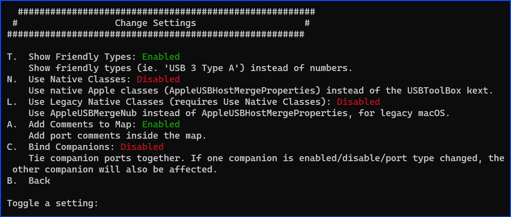
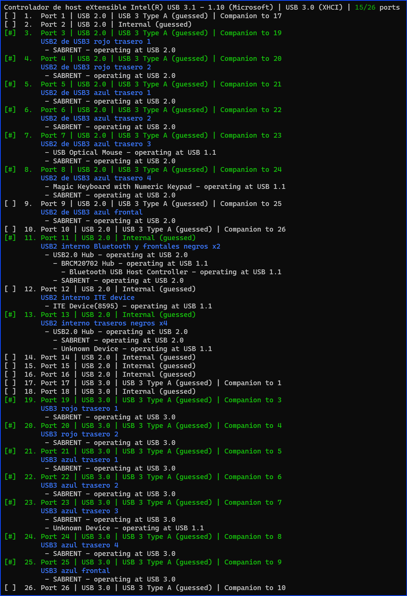
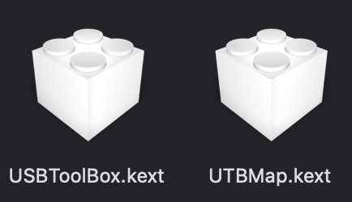

# USB ports map for macOS with USBToolBox from Windows

[(Spanish version)](README-ES.md)

### Summary

How to generate USB port map on Windows for use on macOS, which has a limit of 15 ports per USB controller, using [dhinakg](https://github.com/dhinakg)'s USBToolBox. This is currently the easiest method of generating the USB port map for macOS with the only downside being that you need a Windows system on the same machine.

### Download the tool

On the GitHub [site](https://github.com/USBToolBox) you have the tool for Windows (tool >> Releases >> Windows.zip). For now it is all you need.

### Create the port map

In the unzipped folder, run Windows.exe. A command window opens in which the entire process takes place.

**Letter C** to access the settings
 
Here I only enable 2 options: Show Friendly Types (facilitates the reading of the detected ports) and Add Comments to Map (allows adding identifying comments to each port such as "rear blue USB3").

**Letter D** to show all the ports detected by the tool
 
Almost all the motherboards that we have in the Hackintosh have more than 15 ports, which is the maximum limit tolerated by macOS. In my case, there are 26 ports. If I use macOS as-is, without port mapping, some will be enabled and some won't, some will probably run at the wrong speed and sleep will almost certainly not work well. For this reason, it is necessary to generate the map, to define the 15 ports that we are going to have active in macOS and that will be the only ones that we can use.
Notice that the ports that have any device connected are in green and the rest are in white.
 
In this phase you need a type 2 USB device and a type 3 USB device. I have used a USB3 external disk and 2 cables to connect it to the PC, one of which is USB2 and the other is USB3. You can also use 2 USB memories, one USB2 and one USB3.

* Start with the USB2 device and at the end you repeat with the USB3 (or vice versa)
* Connect it in each of the ports, whether USB2 or USB3, until you check that it appears in the list of ports
* When you remove the device, it also disappears from the list but is saved for the next step
* When finished with both devices, letter B to return to the previous menu.

**Letter S** to choose the ports and build the kext

* In the list, each port you plugged a device into has the device associated with it. In addition to those who already had one connected (those in green)
* Here you can give a name to the ports that you are going to choose, for this you write `c:x:name` where x is the number of the port and name is the name that you want to give it (it can be several words)
* It is time to make the selection. The most comfortable is to use N to deselect all ports and then write the numerical list of those chosen in the way 1,2,3,4,5 without exceeding 15 ports.
* At the end, the list shows which are the 15 ports chosen and the comment that we have written in each of them.

**Letter K** to generate UTBMap.kext
 
This is the kext that macOS will use. It does not work by itself but must be accompanied by USBToolBox.kext downloaded from the same GitHub site. Both together in the OpenCore or Clover Kexts folder. In the config.plist file, USBToolBox.kext has to be before UTBMap.kext.

An additional advantage that this method has over USBMap.kext from [corpnewt](https://github.com/corpnewt) or USBPorts.kext from [Hackintool](https://github.com/benbaker76/Hackintool) is that it does not depend on the SMBIOS model, in these you have to modify the Info.plist file of the kext when changing Mac models.

